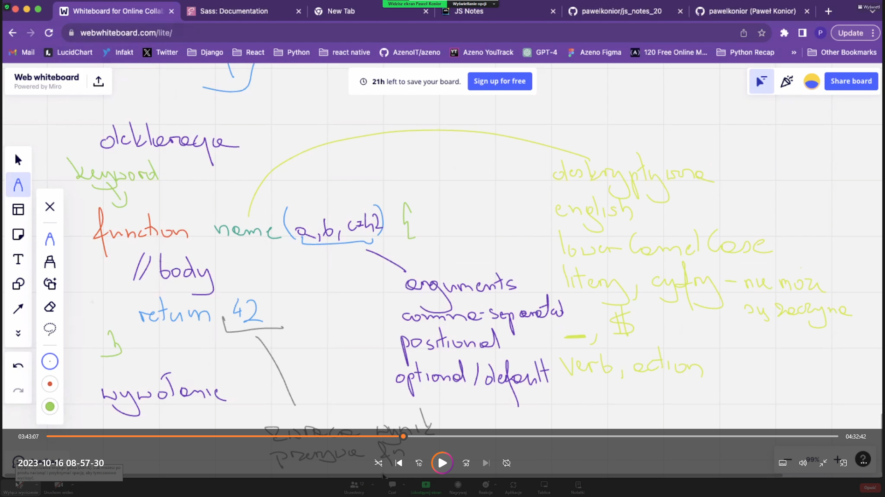

# js note

## variables

różnice |      var       | let | const
:---: |:--------------:| :---: | :---: 
redeclaration | + quircks mode | - | - 
re-assignmnet |       +        |  +  |  -
hosting |       +        | +TDZ  |  +TDZ
scope |    function    | block | bloc 
  ---
## Function
1. Named Functions
2. Anonymous Functions
- classic
- arrow function

